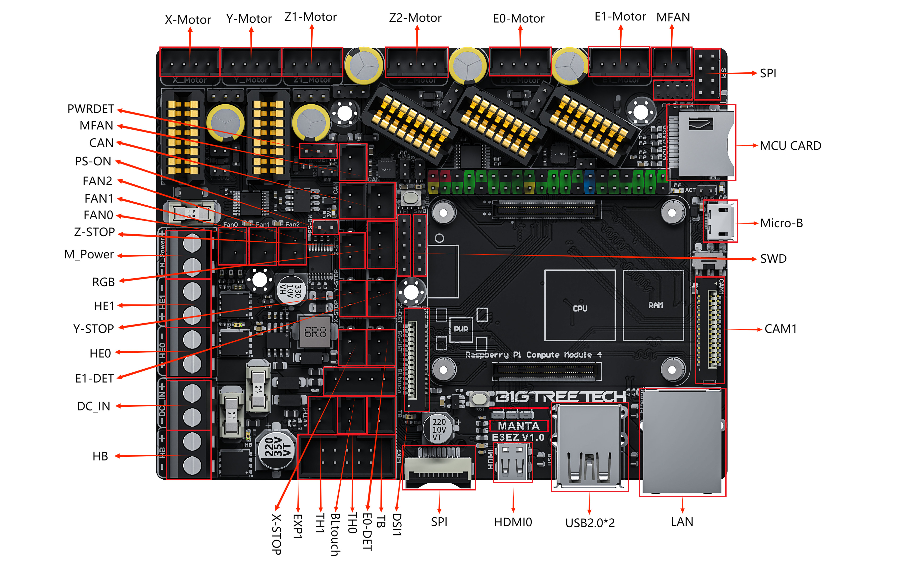

Additional setup

Printer.cfg
> [include sudrien-bigtreetech-manta-e3ez.cfg]

Cura >> settings >> printer >> manage printers >> machine settings

Start G-code
> START_PRINT BED_TEMP={material_bed_temperature_layer_0} EXTRUDER_TEMP={material_print_temperature_layer_0}

End G-code
> END_PRINT

Cura Plugins
- Calibration shapes
- Mesh tools (slow, maybe not for long)
- Moonraker connection (stack of error messages if printer isn't on)

Cura custom profile changes
- retraction length: 1mm (can grind filament beyond gripability otherwise)

